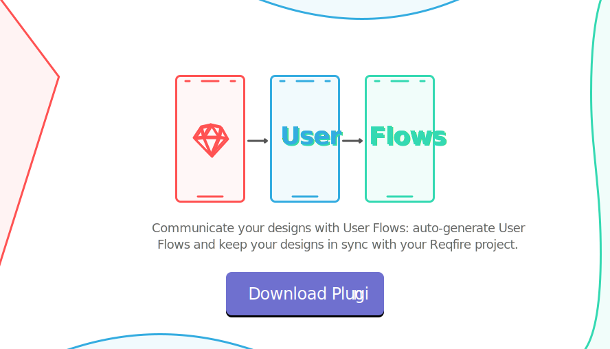
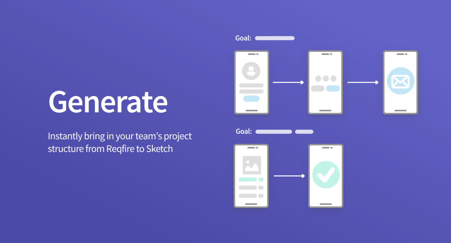
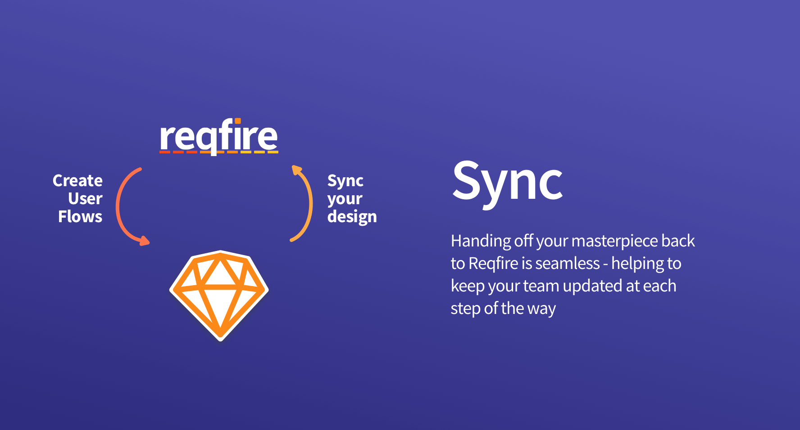
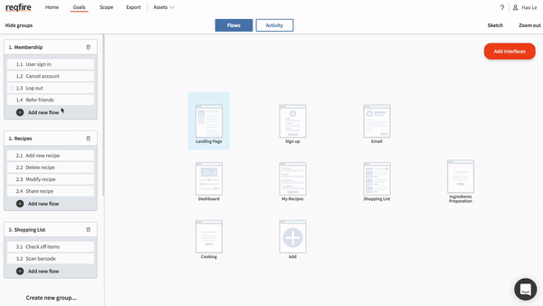
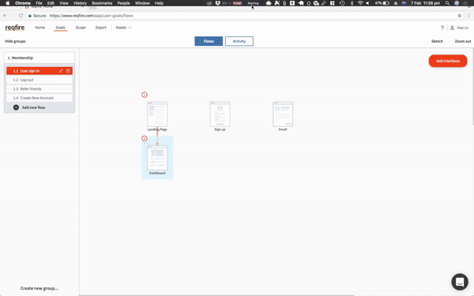
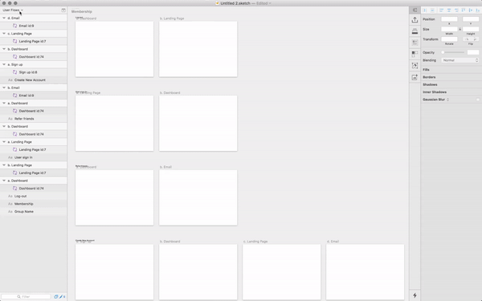

# Sketch User Flows

## Contents
* Overview 
* Installation 
* How it works 
* FAQ 
* Get in touch

## The quickest way to create User Flows in Sketch

Communicate your designs with User Flows: auto-generate User Flows and keep your designs in sync with your Reqfire project.

**Generate** User Flow maps from your Reqfire project. 

**Sync** your designs in Sketch with your User Flows as they develop.

## Installing
You can download our plugin right here:

Is this your first plugin? Here's the docs to better understand [how Sketch plugins work](https://www.sketchapp.com/docs/plugins/). 

## Generate and Sync User Flows

---

## How it works: 

### Step 1: Create User Flows in Sketch

### Step 2: Use the plugin to import User Flows to Sketch

### Step 3: Sync your designs with Reqfire

## Get in touch

Feel free to create an Issue or PR. Or drop us an email at [hello@reqfire.com](mailto:hello@reqfire.com)
